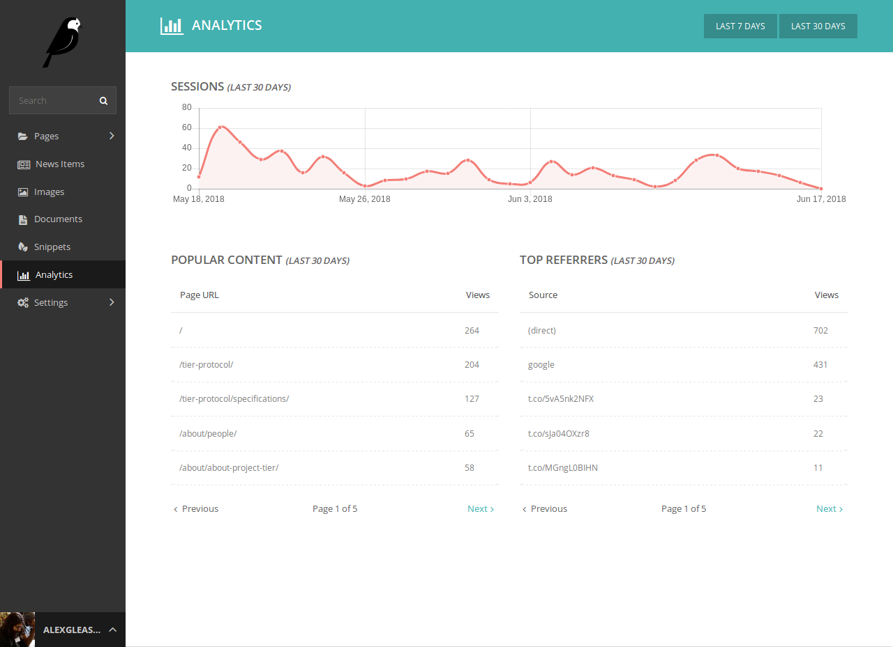

# Wagtail Analytics

This module provides a simple dashboard of Google Analytics data, integrated into the Wagtail admin UI. Tested on Wagtail 1.3.

## Instructions

1. [Create a service account](https://ga-dev-tools.appspot.com/embed-api/server-side-authorization) and download the JSON key
1. Make sure the [Analytics API is enabled for your project](https://console.developers.google.com/apis/api/analytics/overview) (See [issue 2](https://github.com/tomdyson/wagalytics/issues/2))
1. Add the [service account email address](https://console.developers.google.com/permissions/serviceaccounts) as a read-only user in Google Analytics (account > property > user management)
1. [Find the ID](https://lucidpress.zendesk.com/hc/en-us/articles/207335356) for your Google Analytics property
1. Store your JSON key somewhere safe
1. `pip install wagalytics`
1. Add 'wagalytics' to your INSTALLED_APPS
1. Add 'wagtailfontawesome' to INSTALLED_APPS if it's not there already
1. Update your settings:
 - `GA_KEY_FILEPATH = '/path/to/secure/directory/your-key.json'`
 - `GA_VIEW_ID = 'ga:xxxxxxxx'`

If you get CryptoUnavailableError errors, you probably need to `pip install PyOpenSSL` and/or `pip install pycrypto`. See [StackOverflow](http://stackoverflow.com/questions/27305867/google-api-access-using-service-account-oauth2client-client-cryptounavailableerr).

### TODO

 - [ ] allow configuration of results
 - [ ] better styling, e.g. using [chart.js](https://ga-dev-tools.appspot.com/embed-api/third-party-visualizations/)
 - [ ] Throw an error if the relevant settings aren't available
 - [ ] use insert_global_admin_css hook when Wagtail 1.4 is released
 - [ ] add per-page results

### Notes

This module doesn't help with recording user activity. See [the Wagtail docs](http://docs.wagtail.io/en/v1.3.1/topics/writing_templates.html?highlight=analytics#varying-output-between-preview-and-live) and [StackOverflow](http://stackoverflow.com/a/1272312/181793) for pointers on how to avoid gathering data during preview and testing.

### Contributors

Thijs Kramer
